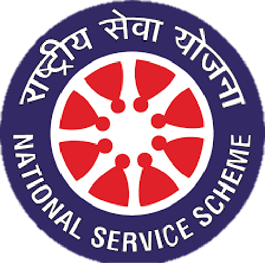

# 
Events organized by NSS-DRAIT

<b>
2023-24
</b>

    <b>
        <table border="border">
            <tr> <td><a href="./AWARENESS PROGRAMME ON DRUG ADDICTION/">1. AWARENESS PROGRAMME ON DRUG ADDICTION</a></td><td>28th FEB 2023</td></tr>
            <tr> <td><a href="./CAMPUS CLEANING PROGRAM/">2. CAMPUS CLEANING PROGRAM</td><td>6th APR 2023</td></tr>
            <tr> <td><a href="./WORLD ENVIRONMENT DAY/">3. WORLD ENVIRONMENT DAY</td><td>5th JUNE 2023</td></tr>
            <tr> <td><a href="./YOGA DAY/">4. YOGA DAY</td><td>21st JUNE 2023</td></tr>
            <tr> <td><a href="./DENTAL CAMP/">5. DENTAL CAMP</td><td>25th JULY 2023</td></tr>
            <tr> <td><a href="./HEALTH CAMP/">6. HEALTH CAMP</td><td>26th JULY 2023</td></tr>
            <tr> <td><a href="./VOLUNATRY BLOOD DONATION CAMP/">7. VOLUNATRY BLOOD DONATION CAMP</td><td>27th JULY 2023</td></tr>
            <tr> <td><a href="./ECO-FRIENDLY DEEPAWALI/">8. ECO-FRIENDLY DEEPAWALI</td><td>10th NOV 2023</td></tr>
            <tr> <td><a href="./CONSTITUTION DAY/">9. CONSTITUTION DAY</td><td>26th NOV 2023</td></tr>
            <tr> <td><a href="./NSS CAMP - BOODIPADAGA/">10. NSS CAMP - BOODIPADAGA</td><td>11th -13th JAN 2024</td></tr>
        </table>
</b>

 

